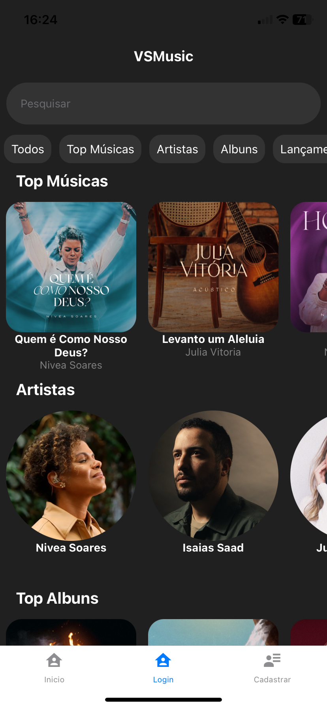

# VSMusic - Aplicativo para estudo de música

- Descrição do Projeto:

O projeto VSMusic tem como objetivo desenvolver uma plataforma inovadora de música, voltada especialmente para o estudo individual de instrumentos musicais. A plataforma permitirá aos usuários ouvir faixas musicais de forma segmentada, destacando cada instrumento separadamente. Essa funcionalidade única visa proporcionar uma experiência de aprendizado mais focada e eficiente, possibilitando aos músicos, de diferentes níveis de habilidade, estudar e praticar seus instrumentos de maneira isolada.

 - Motivação:

A necessidade de uma ferramenta como o VSMusic surge da observação de que muitos músicos encontram dificuldades em distinguir e focar nos sons de seus instrumentos dentro de uma faixa musical completa. A habilidade de isolar instrumentos não só melhora a capacidade de aprendizado, mas também permite uma prática mais direcionada e eficaz. Este projeto não só contribuirá para o desenvolvimento técnico dos músicos, mas também incentivará a prática musical regular e estruturada.

 - Funcionalidades Principais:

Isolamento de Instrumentos: Implementar a tecnologia de separação de áudio que permitirá ao usuário selecionar e ouvir apenas o instrumento desejado.
Biblioteca de Músicas: Disponibilizar uma biblioteca de músicas de diferentes gêneros e estilos (para esse projeto, o gênero escolhido foi Worship).

- A Plataforma:

Ao iniciar o aplicativo, temos a tela inicial do aplicativo que nos dá a opção de cadastro ou de login.
Neste projeto, precisamos sempre cadastrar um usuário para poder ter acesso total ao aplicativo.

Então vamos para a página de cadastro. A página de login é exatamente igual.

Após entrarmos no aplicativo, então poderemos observar a tela principal, onde estão todas as músicas, artistas e álbuns que nosso programa possúi.

Ao clicar em uma música, então iremos ser redirecionados para a tela da música, onde poderemos escolher qual opção queremos ouvir. Também temos a letra da música para poder estudar exatamente igual a música original.
Acima da imagem da música, podemos observar um botão com o símbolo de uma setinha. Esse botão serve para podermos voltar a página inicial do programa.

Voltando para a página principal, podemos escolher outra música, artista ou álbum para acessar. Vamos agora acessar a página de artista.
Nessa página, temos sua imagem e um texto informando sobre o artista.

Voltando novamente para a página principal, vamos acessar a página de álbum.
Por conta de estar em fase de aprendizado e tempo, essa página contém apenas sua imagem, o nome do álbum e o nome do artista.

